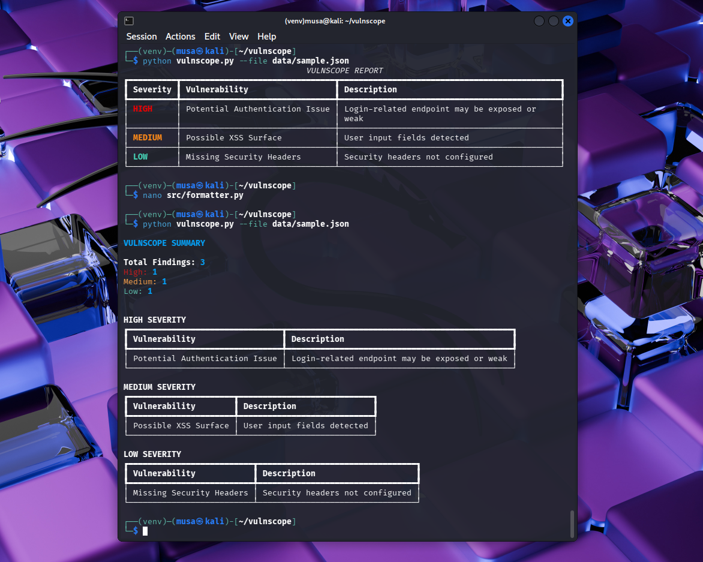

# VulnScope

VulnScope is a simple CLI tool that simulates vulnerability detection and generates structured security reports in the terminal.

It is a beginner DevSecOps project built to practice:
- Python CLI development
- Rule-based detection logic
- Structured reporting

---

## Features

- Simulated vulnerability detection using rules
- Severity classification (High / Medium / Low)
- Grouped terminal output with summary
- CLI filtering by severity
- Export report to file

---
DEMO

---

## Installation

```bash
git clone https://github.com/YOUR_USERNAME/vulnscope.git
cd vulnscope
python3 -m venv venv
source venv/bin/activate
pip install rich
